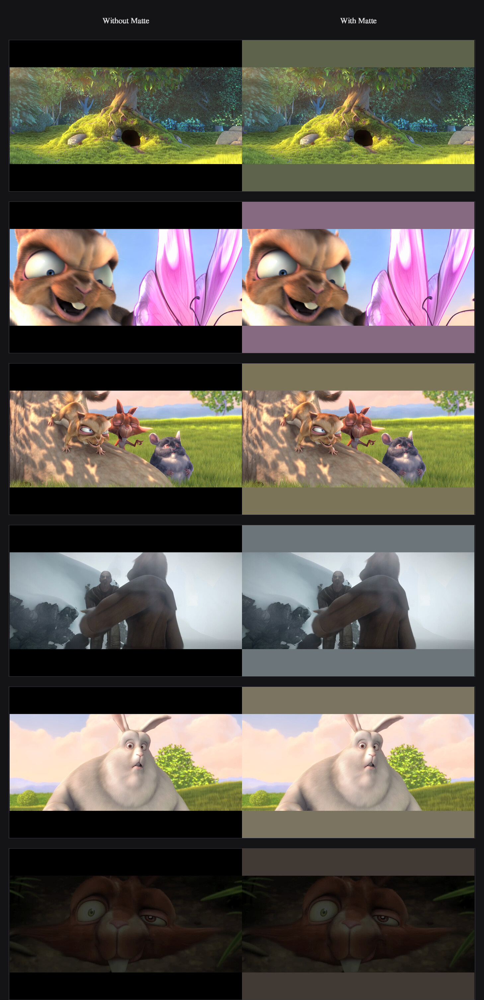

# Matte

**Matte fills the black areas of full screen with a color that suits the picture.** On a MacBook, when a video or an app goes full screen, the letterbox and pillarbox bars -- and the camera-housing band beside the notch -- are drawn pure black, and the frame ends up floating in a void. Matte replaces that black with a muted, low-saturation color sampled from the picture itself, so the surround feels like part of the image. It works at the source (mpv's `background` inside IINA, a colored overlay elsewhere), changes no system files and injects no process, and reverts completely when you quit. The original spark was a corner-damaged panel that leaked light against pure black.

## The effect

The bar color is sampled from the picture, so it adapts to every scene -- green fields, warm fur, cool mist:



<sub>Frames from the open movies Big Buck Bunny and Sintel, (c) Blender Foundation, licensed CC BY 3.0.</sub>

## Install

Requirements: a MacBook running macOS 14 or later, and (optional) [IINA](https://iina.io) for source-level video handling.

```bash
git clone https://github.com/YC11Hou/matte-fill.git
cd matte-fill
./build.sh
```

`build.sh` compiles the agent to `~/Applications/Matte.app`, installs a LaunchAgent that starts it at login, and installs the IINA plugin. On first run, grant screen recording:

> System Settings -> Privacy & Security -> Screen & System Audio Recording -> enable **Matte**

Then it runs automatically. A few optional controls:

```bash
# which displays it works on (default: the built-in display only)
~/Applications/Matte.app/Contents/MacOS/matte-fill --displays builtin|all

# make full-screen switching instant, removing the transition seam (fully reversible)
~/Applications/Matte.app/Contents/MacOS/matte-fill --instant on|off
```

Settings live in `~/.config/matte-fill/config.json` (every field optional, applied within a second); `fadeSeconds` controls how gently the color eases in. To uninstall:

```bash
launchctl bootout gui/$(id -u)/io.github.matte-fill
rm -r ~/Library/LaunchAgents/io.github.matte-fill.plist ~/Applications/Matte.app
```
